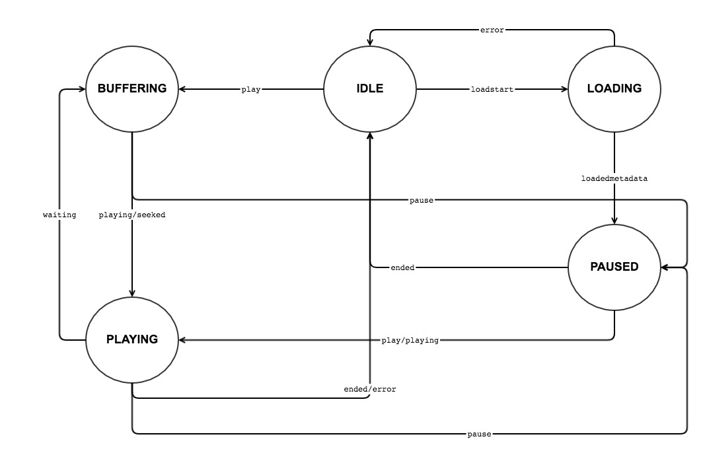

# Player States
The player manage lifecycle states which are HTML5 video events based. I.e, when an HTML5 video event is triggered by the video element, it can change the player state. If there are state changes, the player will fire related event.

## State Class
The `State` class API can be seen [here]().

## State Types
The full list of player states can be seen [here]().
<br>An example how we can access a player state type:
```js
console.log(player.State.PLAYING); // 'playing'
```
## Transitions Between States
A **transition** is defined when the player is move from one state to another.
<br>For example, if the player current state is `PLAYING` and the video element triggered `pause` event, the player will change his state to `PAUSED`.

The player state machine can be seen in the following figure:


## Registering to State Changed
When the player changes his state, he fires `PlayerStateChanged` event. The event data contains his old state and his new state. Your application can listen to this event and manage dependent logic accordingly (mainly UI).
<br>For example:
```js
player.addEventListener(player.Event.PLAYER_STATE_CHANGED, (event)=> {
	const State = player.State;
	const payload = event.payload;
	if (payload.oldState.type === State.PLAYING
		&& payload.newState.type === State.BUFFERING) {
		// Buffer underflow
	}
});
```

```js
player.addEventListener(player.Event.PLAYER_STATE_CHANGED, (event)=> {
	const State = player.State;
	const payload = event.payload;
	if (payload.newState.type === State.BUFFERING) {
		// Show spinner
	}
});
```
